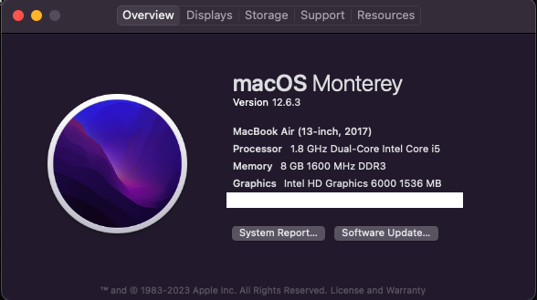
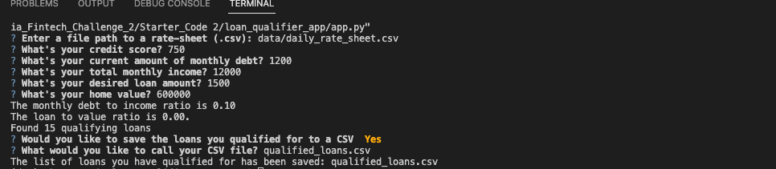
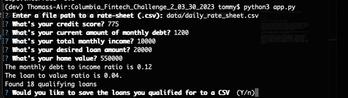
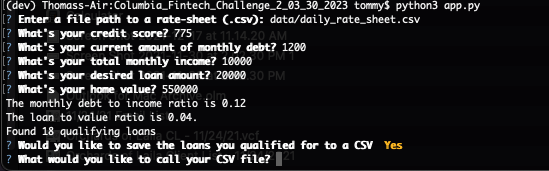
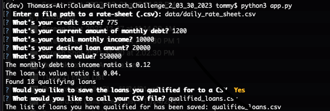
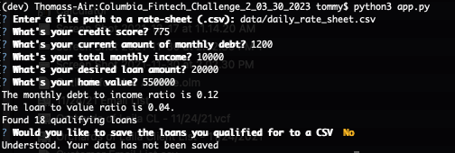
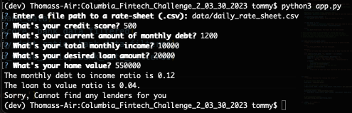

# *Columbia Fintech Challenge 2*

The program as originally written in the starter code will show a user how many loans they qualify for by comparing their current monthly debt, monthly income, desired loan and home value against a daily rate sheet that holds the qualifying requirements for lenders. In addition to letting the user know how many loans that they qualify for, the program will display the user's debt to income ratio and the loan to value ratio.

In the updated version, the program will prompt the user to save the results to a new CSV file if wanted by the user. Additionally the program will ask the user for a file path to save the file (if the user has indicated that they would like the results saved)

If the user does not qualify for any loans, the program will inform the user that they do not qualify for any loans and exit.

---

## Technologies ##

### **Hardware Used**

MacBook Air (13-inch, 2017)

    Processor 1.8 GHz Dual-Core Intel Core i5
    macOS Monterey version 12.6.3



### **Dependencies**

This project used python 3.11 with the following packages:

* [sys](https://docs.python.org/3/library/sys.html?highlight=sys#module-sys) 

* [pathlib](https://docs.python.org/3/library/pathlib.html) 
  
* [csv](https://docs.python.org/3/library/csv.html?highlight=csv#module-csv) 

* [fire](https://github.com/google/python-fire)

* [questionary](https://github.com/tmbo/questionary) 


### **Development Software**


anaconda Command line client 1.10.0

    conda 23.1.0
    Python 3.11.2

pip 23.0.1 from /usr/local/bin/python3/site-packages/pip (python 3.11)

    fire 0.3.1
    questionary 1.5.2

git version 2.37.2

Visual Studio Code Version: 1.76.2

---
## *Pre-Installation Guide*

Before running the application first install the following dependencies.

```python
  pip install fire
  pip install questionary
```


---

## **Installation Guide**

In the terminal, go to the directory where you would like to install this application from the repository and enter the following command:

```python
git clone git@github.com:tmagee28/Columbia-Fintech-Challenge01-03-30-2023.git
```

---

## **Usage**

From terminal, the installed application is run from the installed directory by typing at prompt:

```python
  python3 app.py
```


The below will display examples of the steps to take promts the user should expect using multiple examples:

###    Example 1 - Candidate Qualifying for Multiple Loans





###    Example 2 - Candidate Qualifying for Multiple Loans that does not want to save data



###    Example 3 - Candidate not qualifying for any loans


---


## **Version control**

This project was transferred to its current / new repository location.  For current / post-transfer GitHub repository version control history information please follow hyperlink.

[post-transfer-repository](https://github.com/tmagee28/Columbia-Fintech-Challenge_02_Loan_Qualifier_App)

Pre-transfer GitHub repository version control history information please follow hyperlink.

[pre-transfer-repository](https://github.com/tmagee28/Columbia-Fintech-Challenge_02-03-30-2023)

---

## **Contributors**

### **Author**

Tommy Magee
[LinkedIn](https://www.linkedin.com/in/thomas-magee-2009a72a/)


### **BootCamp lead instructor**

Vinicio De Sola

### **BootCamp teaching assistants**

Eli Holden


### **GitHub example and reference**

Loki Skylizard
[@GitHub](https://github.com/Billie-LS/loan_prequal_qualifier_app)
---

## License

MIT License

Copyright (c) [2022] [Thomas 'Tommy' Magee]

Permission is hereby granted, free of charge, to any person obtaining a copy
of this software and associated documentation files (the "Software"), to deal
in the Software without restriction, including without limitation the rights
to use, copy, modify, merge, publish, distribute, sublicense, and/or sell
copies of the Software, and to permit persons to whom the Software is
furnished to do so, subject to the following conditions:

The above copyright notice and this permission notice shall be included in all
copies or substantial portions of the Software.

THE SOFTWARE IS PROVIDED "AS IS", WITHOUT WARRANTY OF ANY KIND, EXPRESS OR
IMPLIED, INCLUDING BUT NOT LIMITED TO THE WARRANTIES OF MERCHANTABILITY,
FITNESS FOR A PARTICULAR PURPOSE AND NONINFRINGEMENT. IN NO EVENT SHALL THE
AUTHORS OR COPYRIGHT HOLDERS BE LIABLE FOR ANY CLAIM, DAMAGES OR OTHER
LIABILITY, WHETHER IN AN ACTION OF CONTRACT, TORT OR OTHERWISE, ARISING FROM,
OUT OF OR IN CONNECTION WITH THE SOFTWARE OR THE USE OR OTHER DEALINGS IN THE
SOFTWARE.

